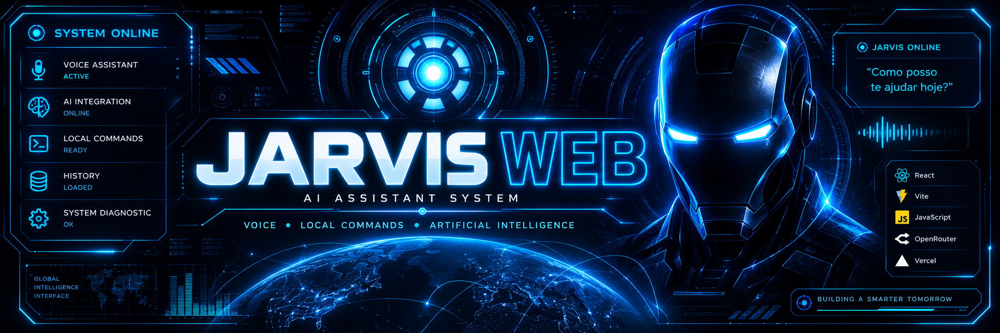

<div align="center">



# ⚡ JARVIS WEB

### Assistente virtual com voz, comandos locais e Inteligência Artificial


**[🌐 ACESSAR JARVIS ONLINE](https://jarvis-7wktg97tp-gil-testa.vercel.app/)**

</div>

---

## 🤖 SOBRE O JARVIS

O **JARVIS Web** é uma SPA desenvolvida com **React + Vite** para a P1
de Desenvolvimento Mobile do curso de ADS da FATEC.

O sistema combina:

🎙️ Reconhecimento de voz  
🔊 Respostas faladas  
⚡ Comandos locais  
🧠 Inteligência Artificial via OpenRouter  
📜 Histórico de interações  
💠 Interface inspirada em HUDs futuristas

---

## 🧠 INTELIGÊNCIA ARTIFICIAL

Quando o JARVIS não reconhece a entrada como um comando local:

```text
PERGUNTA
   ↓
COMANDOS LOCAIS
   ↓
/api/chat
   ↓
OPENROUTER
   ↓
INTELIGÊNCIA ARTIFICIAL
   ↓
RESPOSTA NA TELA + VOZ

"Quem foi Alan Turing?"
"O que é uma API?"
"Explique Java de forma simples."

O jarvis-banner.png seria uma arte horizontal, azul-neon, com o rosto/núcleo do JARVIS e escrito JARVIS WEB. Aí o GitHub abre e PÁ — aquela identidade visual azul neon logo no topo, mas todo o conteúdo exigido pelo professor continua embaixo.
E tem uma vantagem: isso não mexe em absolutamente nada no funcionamento do projeto. É só apresentação do GitHub.
Se vamos mandar o Codex fazer, eu faria ele reestruturar o README inteiro nesse estilo, preservando 100% das informações técnicas que já estão corretas, em vez de substituir tudo por uma imagem.
